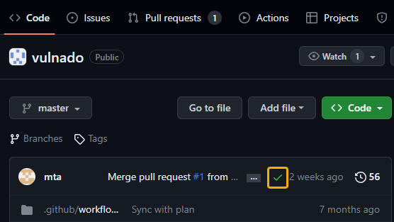

# Veracode GitHub Workflow Integration 

The Veracode GitHub Workflow Integration allows you to set up a security scanning program for all of your GitHub repositories in a single configuration file.

This repository includes the workflows required for the GitHub Workflow Integration to function correctly. In addition, it includes the configuration file, `veracode.yml`, which stores the default settings for you to scan your repositories with Veracode.

This README explains the steps required to configure your Veracode scans and view your scan results.

## Enable GitHub Actions

Ensure that this repository and the repositories you want to scan have [GitHub Actions enabled](https://docs.github.com/en/repositories/managing-your-repositorys-settings-and-features/enabling-features-for-your-repository/managing-github-actions-settings-for-a-repository).

## Setting up GitHub secrets for scanning

You must add the appropriate GitHub secrets to this repository to enable the GitHub actions that run when a specified GitHub event is triggered.

### Configure Veracode API ID and secret key for Static Analysis

1. [Generate your Veracode API ID and secret key](https://docs.veracode.com/r/t_create_api_creds) from the [Veracode Platform](https://analysiscenter.veracode.com/auth/index.jsp#APICredentialsGenerator).
2. Configure a [Github secret in your repository](https://docs.github.com/en/actions/security-guides/using-secrets-in-github-actions#creating-secrets-for-a-repository) called `API_ID' for your Veracode API ID and another called 'API_SECRET' for your API secret key.

### Configure SCA agent token

Veracode uses the SCA agent within your workflows to scan your code.  

1. Identify the agent token value for the SCA workspace in which you want your scan results to appear. If you do not know the token, you can [regenerate it](https://docs.veracode.com/r/Regenerate_Veracode_SCA_Agent_Tokens). 
2. Configure a [Github secret in your repository](https://docs.github.com/en/actions/security-guides/using-secrets-in-github-actions#creating-secrets-for-a-repository) called `SRCCLR_TOKEN' for your token.

## Language support

The GitHub Workflow Integration supports scanning repositories written in the following languages:

| Language         | Static Support | SCA Support |
|------------------|----------------|-------------|
| Java             | X              | X           |
| JavaScript       | X              | X           |
| TypeScript       | X              | X           |
| Python           | X              | X           |
| PL/SQL           | X              |             |
| Transact-SQL     | X              |             |
| C#               | X              | X           |
| PHP              | X              | X           |
| Perl             | X              |             |
| Ruby             | X              | X           |
| Go               | X              | X           |
| Visual Basic 6.0 | X              |             |
| Apex             | X              |             |

For Static Analysis, the GitHub Workflow Integration automatically compiles the repository by default. However, for some applications, you may need to provide specific compilation instructions in the original repository. See the [packaging requirements](https://docs.veracode.com/r/compilation_packaging) for each language.

For SCA, see the [agent-based scan support matrix](https://docs.veracode.com/r/c_sc_agent_languages) for additional support details.

## How scanning works

In your `veracode.yml` file, you can customize the behavior of the GitHub Workflow Integration. You can apply several configurations, including: 
- The types of scans to run
- Which branches to target
- Which Veracode security policy to apply
- Whether a failure breaks the build
- Whether the scan is triggered by a push or a pull
- The compilation instructions

By default, your `veracode.yml` file is configured with the following scan triggers:
- Static pipeline scan on any push activity on any branch
- SCA agent-based scan on any push activity on any branch
- Veracode Container Security scan on any push activity on any branch
- Static policy scan with 'break the build' functionality when a pull activity happens on your default branch

You can configure all of these to fit your own organization's process by editing the `veracode.yml` file.

## View results

After scans of a repository are complete, the Veracode security findings are available in the [check](https://docs.github.com/en/pull-requests/collaborating-with-pull-requests/collaborating-on-repositories-with-code-quality-features/about-status-checks#checks) for the repository. 

To view the findings: 

1. Open a GitHub repository in which a scan has been completed.
2. Select the branch you want to view.
3. Select the status icon of the check. The icon can be a green checkmark, a red X, or an orange circle.
   
4. Select **Details**. 

For scans triggered by a pull request, you can also view the findings on the request. 

1. Open a GitHub repository in which a scan has been completed.
2. Select the **Pull Requests** tab.
3. Select the pull request.
4. Select the **Checks** tab or the **Files changed** tab.

   The **Files changed** tab displays the findings details inline so you can see exactly where in the code the flaw was identified.

### Reviewing results

Static Analysis scans return a list of annotations describing each static flaw and a link to the Veracode Platform where you can view a full report of your results. If an [application profile](https://docs.veracode.com/r/request_profile) for a scanned repository does not already exist in the Veracode Platform, Veracode automatically creates one using the name of the repository as the name of the profile. 

For more information on reviewing Statis Analysis findings, see [Reviewing scan results](https://docs.veracode.com/r/review_results).

SCA scans return a summary report of your open source security findings as well as a detailed list of libraries, vulnerabilities, and licenses. For more information about SCA findings, see [Viewing agent-based scan results](https://docs.veracode.com/r/Viewing_Agent_Based_Scan_Results).
